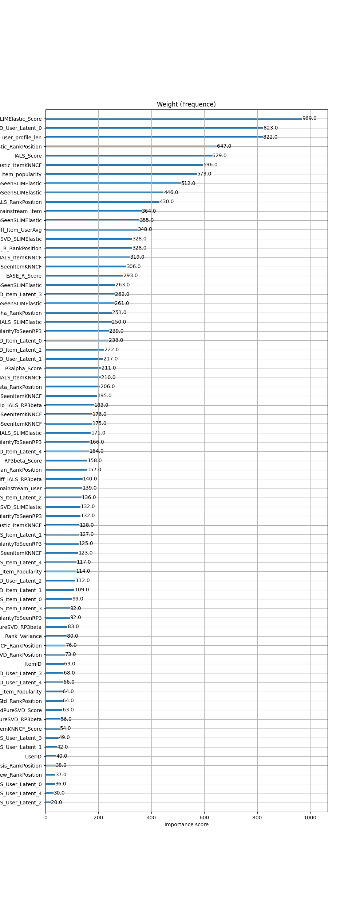

# Polimi Recommender Systems Challenge A.Y. 2025/26

This repository contains the complete code, methodology, and technical artifacts used by **Gorgonzola Racing Team** in the **Polimi RecSys Challenge 2025/26**.

**Team Gorgonzola Racing Team**:  
* **Simone Somazzi**: [LinkedIn](https://www.linkedin.com/in/simone-somazzi-27395a226/) | [GitHub](https://github.com/SimoSaimon/)  
* **Filippo Galletta**: [LinkedIn](https://www.linkedin.com/in/filippogalletta) | [GitHub](https://github.com/filippogalletta)  

**Course**: Recommender Systems 2025/26 @ Politecnico di Milano  

---

## Results

**Official Final Competition Performance**
* **Final Recall@20**: **0.52522** (within ~1.2% of the competition winner)
* **Benchmark Comparison**: Outperformed the faculty's strongest baseline (**B5: 0.51026**)
* **Competing Teams**: 71

---

## Dataset Overview
* **Interactions**: ~3.04 Million implicit interactions
* **Unique Users / Items**: 27,095 Target Users / 6,969 Catalog Items
* **Matrix Density**: ~1.61% (Sparsity > 98.39%)
* **Data Characteristics**: High sparsity, severe long-tail distribution, strong popularity bias, cold-start users.

---

## System Architecture

Our solution is built on a scalable **Two-Stage Recommender System** architecture designed to optimize the trade-off between retrieval recall and precision reranking:

```
+-------------------------------------------------------------------------+
|                  STAGE 1: RETRIEVAL (CANDIDATE GENERATION)              |
|                                                                         |
|   SLIM ElasticNet  ──┐ (alpha=0.157)                                    |
|   EASE_R           ──┴──> W_12  ──┐ (beta=0.088)                        |
|   RP3beta          ───────────────┴──> W_final (CustomKNN)  ──┐         |
|   Implicit ALS (iALS) ────────────────────────────────────────┴── (gamma=0.127)
|                                                                         |
|                                            ==> Top 90 Candidates/User   |
+-------------------------------------------------------------------------+
                                     │
                                     ▼
+-------------------------------------------------------------------------+
|                  STAGE 2: FEATURE ENGINEERING & RERANKING               |
|                                                                         |
|   * 7 Base Recommenders (Linear, Neighborhood, Graph, Factorization)    |
|   * 70+ Tabular Features (Higher-order Moments, Dual Latent Factors,    |
|     Cross-Model Ratios, Mainstreamness, Score/Rank Normalizations)      |
|   * Pairwise XGBRanker (rank:map, 100+ Bayesian Optuna Trials)          |
|                                                                         |
|                                            ==> Final Top-20 Predictions |
+-------------------------------------------------------------------------+
```

---

### Stage 1: Candidate Generation (Hierarchical M3 Hybrid)

To maximize the theoretical **Recall Ceiling** without suffering from combinatorial feature explosion in the second stage, we engineered a multi-level **Hierarchical Hybrid Recommender (M3)**:

1. **Similarity-Level Fusion (W12)**: Convex combination of the sparse item-item similarity matrices of **SLIM ElasticNet** and **EASE_R** ($\alpha = 0.157$):
   $$W_{12} = (1 - \alpha) W_{SLIM} + \alpha W_{EASE}$$
2. **Graph-Level Fusion (W_final)**: Blending $W_{12}$ with the 3-hop random walk transition matrix of **RP3beta** ($\beta = 0.088$):
   $$W_{final} = (1 - \beta) W_{12} + \beta W_{RP3}$$
3. **Score-Level Blending**: Linear combination of the custom neighborhood model ($URM \cdot W_{final}$) with **Implicit ALS (iALS)** latent factor ratings ($\gamma = 0.127$):
   $$\text{Score} = (1 - \gamma) \cdot \text{Score}_{KNN} + \gamma \cdot \text{Score}_{iALS}$$

* **Operating Point**: We select a compact cutoff of **90 candidates per user**, capturing **>85%** of all relevant validation interactions while keeping the training matrix below 2.5 million rows.
* See detailed analysis in [notebooks/01_Candidate_Generation_Analysis.ipynb](notebooks/01_Candidate_Generation_Analysis.ipynb).

---

### Stage 2: 70+ Feature Engineering & XGBRanker

The generated candidate pool is enriched with 70+ features across 6 distinct signal categories before being passed to an **XGBRanker** model:

1. **Base Model Predictions**:
   * Raw $L_\infty$-normalized scores across 7 base models.
   * Per-user standardized scores (`Score_norm`: Z-score normalization per user).
   * Exact rank positions (`RankPosition`) and inverse logarithmic ranks (`RankInv = 1.0 / log2(2 + rank)`).
2. **Higher-Order Statistical Moments of Similarity**:
   * Slicing item-item similarity matrices ($W_{sparse}$) of SLIM, RP3beta, and ItemKNN against the user's interaction history to compute: **Mean, Max, Min, Standard Deviation, Skewness, and Kurtosis** (`AvgSimilarityToSeen`, `MaxSimilarityToSeen`, etc.).
   * Captures whether a candidate item has a single strong anchor in the user history (high max/skewness) or broad weak affinity.
3. **Model Consensus & Agreement**:
   * Cross-model rank variance (`Rank_Variance`): measures disagreement across base models.
   * Recommendation counter (`Counter_Recommended`): consensus among individual base top-$K$ lists.
   * Rank distribution moments: mean, std dev, skewness, and kurtosis of candidate ranks.
4. **Popularity & Mainstreamness**:
   * Global item popularity and user profile length.
   * Mainstreamness metrics: measuring whether user consumption aligns with mainstream trends vs niche items.
   * Profile popularity variance (`User_Std_Item_Popularity`) and popularity delta (`Pop_Diff_Item_UserAvg`).
5. **Dual Latent Factor Embeddings**:
   * Top 5 latent dimensions extracted from **Implicit ALS** (`IALS_User_Latent_0..4`, `IALS_Item_Latent_0..4`).
   * Top 5 latent dimensions extracted from **ScaledPureSVD** (`SVD_User_Latent_0..4`, `SVD_Item_Latent_0..4`).
6. **Cross-Model Comparative Signals**:
   * **Score Ratios** and **Rank Differences** comparing latent factor models against graph and neighborhood models:
     * `Ratio_IALS_SLIMElastic`, `Diff_IALS_SLIMElastic`
     * `Ratio_IALS_RP3beta`, `Diff_IALS_RP3beta`
     * `Ratio_ScaledPureSVD_SLIMElastic`, `Diff_ScaledPureSVD_SLIMElastic`
     * `Ratio_ScaledPureSVD_RP3beta`, `Diff_ScaledPureSVD_RP3beta`
     * `Ratio_IALS_ItemKNNCF`, `Diff_IALS_ItemKNNCF`

---

## Feature Importance



| Rank | Feature | Category | Importance (Weight) |
| :---: | :--- | :--- | :---: |
| 1 | `SLIMElastic_Score` | Base Model Signal | 740.0 |
| 2 | `EASE_R_Score` | Base Model Signal | 415.0 |
| 3 | `IALS_Score` | Base Model Signal | 375.0 |
| 4 | `StdSimilarityToSeenSLIMElastic` | Similarity Distribution | 324.0 |
| 5 | `ItemKNNCF_Score` | Base Model Signal | 290.0 |
| 6 | `SLIMElastic_RankPosition` | Base Model Rank | 290.0 |
| 7 | `AvgSimilarityToSeenSLIMElastic` | Similarity Distribution | 285.0 |
| 8 | `P3alpha_Score` | Base Model Signal | 279.0 |
| 9 | `User_Std_Item_Popularity` | User Profiling | 274.0 |
| 10 | `MaxSimilarityToSeenItemKNN` | Similarity Distribution | 271.0 |
| 11 | `SkewSimilarityToSeenSLIMElastic` | Similarity Distribution | 262.0 |
| 12 | `Ratio_IALS_SLIMElastic` | Comparative Interaction | 260.0 |
| 13 | `RP3beta_Score` | Base Model Signal | 255.0 |
| 14 | `Pop_Diff_Item_UserAvg` | Popularity Metric | 245.0 |
| 15 | `SVD_Item_Latent_2` | Latent Factor Embedding | 243.0 |

---

## Repository Structure

```text
.
├── README.md                                  # Project presentation & technical documentation
├── LICENSE                                    # MIT License
├── requirements.txt                           # Python dependencies
├── ROADMAP.md                                 # Implementation milestones & progress tracking
├── assets/
│   └── feature_importance.png                 # Feature importance visualization
├── src/                                       # Modular Python package
│   ├── __init__.py
│   ├── candidate_generation.py                # M3 & M2 Hierarchical Hybrid Recommenders
│   ├── features.py                            # 70+ Feature extraction & RAM optimization
│   ├── reranker.py                            # XGBoost reranker wrapper & submission generator
│   └── models/
│       ├── __init__.py
│       ├── scaled_puresvd.py                  # Scaled PureSVD recommender
│       └── implicit_als.py                    # Feature Combined Implicit ALS
└── notebooks/
    ├── 01_Candidate_Generation_Analysis.ipynb # Stage 1 retrieval & recall ceiling analysis
    └── 02_Final_XGBoost_Pipeline.ipynb        # End-to-end reproducible pipeline
```

---

## Tech Stack
* **Language**: Python
* **Learning-to-Rank**: XGBoost (`XGBRanker` with `rank:map` / `rank:pairwise`)
* **Matrix Factorization**: Implicit, LightFM, Scikit-learn TruncatedSVD
* **Hyperparameter Optimization**: Optuna (Bayesian Tree-structured Parzen Estimator)
* **Scientific Computing**: NumPy, SciPy (CSR sparse matrices), Pandas
* **Evaluation & Benchmarking**: EvaluatorHoldout (Recall@20, MAP@20, NDCG@20)

---

## Acknowledgments
This project is built upon the framework developed by [Maurizio Ferrari Dacrema](https://github.com/remaplab/RecSys_Course_AT_PoliMi) for the Recommender Systems course @ Politecnico di Milano.
